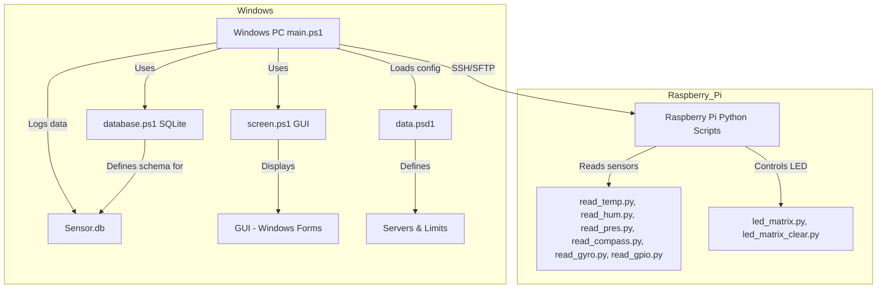

# Pi-Sensor-Monitoring-Powershell
manage and control all hardware settings of a rasberry pi 4 and there connected hardware (sensor, led, motors, hats, ...)
# Pi-Sensor-Monitoring-Powershell

A cross-platform PowerShell and Python toolkit to manage and control all hardware settings of a Raspberry Pi 4 and its connected hardware (sensors, LEDs, motors, HATs, etc.) remotely via SSH. The project provides a Windows GUI for monitoring, database logging, and real-time control.

## Features

- **Remote Sensor Monitoring:** Collect temperature, humidity, pressure, and compass data from Sense HAT sensors.
- **LED Matrix Control:** Display or clear patterns on the Pi’s LED matrix.
- **GPIO Status Reading:** (Planned) Read all GPIO pin statuses.
- **Database Logging:** Store sensor data in a local SQLite database.
- **Windows GUI:** View sensor data, warnings, and control hardware from a user-friendly interface.
- **Multi-Pi Support:** Manage multiple Raspberry Pi devices from a single dashboard.

## Project Structure

- `main.ps1` – Main entry point, sets up SSH, transfers scripts, starts GUI and background jobs.
- `screen.ps1` – PowerShell GUI helper functions.
- `database.ps1` – SQLite database schema and access functions.
- `data.psd1` – Configuration file for Pi servers and sensor limits.
- `read_temp.py`, `read_hum.py`, `read_pres.py`, `read_compass.py`, `read_gyro.py`, `read_gpio.py` – Python scripts for sensor readings.
- `led_matrix.py`, `led_matrix_clear.py` – Python scripts to control the LED matrix.
- `Sensor.db` – SQLite database file.

## Architecture Diagram



## Getting Started

### Prerequisites

- Windows PC with PowerShell 7+
- [Posh-SSH](https://github.com/darkoperator/Posh-SSH) and [PSSQLite](https://github.com/RamblingCookieMonster/PSSQLite) PowerShell modules
- Raspberry Pi 4 with Sense HAT, SSH enabled, and Python 3 installed

### Installation

1. Clone this repository to your Windows machine.
2. Edit `data.psd1` to add your Raspberry Pi devices and sensor limits.
3. Install required PowerShell modules:
    ```powershell
    Install-Module -Name Posh-SSH
    Install-Module -Name PSSQLite
    ```
4. Run the main script:
    ```powershell
    ./main.ps1
    ```

### Usage

- The GUI will launch, showing tabs for each configured Pi.
- Sensor data is updated automatically and warnings are displayed for out-of-range values.
- Use the "view led" and "clear led" buttons to control the Pi’s LED matrix.

## Contributing

Contributions are welcome! Please see the [Wiki](https://github.com/DragonRouge513/Pi-Sensor-Monitoring-Powershell/wiki) for guidelines.

## License

This project is licensed under the [GNU GPL v3](LICENSE).

## Resources

- [Posh-SSH PowerShell Module](https://github.com/darkoperator/Posh-SSH)
- [PSSQLite PowerShell Module](https://github.com/RamblingCookieMonster/PSSQLite)
- [Sense HAT Python API](https://pythonhosted.org/sense-hat/)
- [Raspberry Pi Documentation](https://www.raspberrypi.com/documentation/)
- [System.Windows.Forms Documentation](https://learn.microsoft.com/en-us/dotnet/api/system.windows.forms)
- [SQLite Documentation](https://www.sqlite.org/docs.html)
